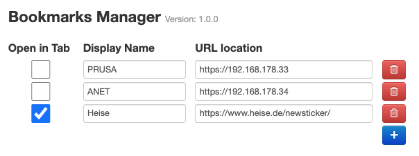
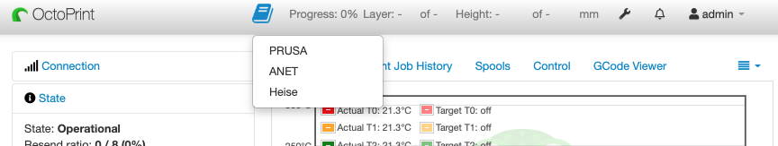

# OctoPrint-BookmarkManager

[]()
[]()


Bookmarks Manager for e.g. easy switching between multiple OctoPrint-Instances


#### Support my Efforts

This plugin, as well as my [other plugins](https://github.com/OllisGit/) were developed in my spare time.
If you like it, I would be thankful about a cup of coffee :)

[](https://www.paypal.com/cgi-bin/webscr?cmd=_s-xclick&hosted_button_id=6SW5R6ZUKLB5E&source=url)


## Screenshots



## Setup

Install via the bundled [Plugin Manager](http://docs.octoprint.org/en/master/bundledplugins/pluginmanager.html)
or manually using this URL:

    https://github.com/OllisGit/OctoPrint-BookmarkManager/releases/latest/download/master.zip

### Position in the navigation bar

If you want to move e.g. the Bookmark-Symbol all the way to the right, you need to edit ```config.yaml``` (see https://docs.octoprint.org/en/master/configuration/config_yaml.html#)
```
appearance:
  closeModalsWithClick: false
  components:
    order:
      navbar:
      - plugin_AutostartPrint
      - plugin_DisplayLayerProgress
      - settings
      - plugin_DryRun
      - plugin_action_command_prompt
      - plugin_PrintJobHistory
      - plugin_DeleteAfterPrint
      - systemmenu
      - plugin_announcements
      - login
      - plugin_BookmarkManager
```

## Versions

see [Release-Overview](https://github.com/OllisGit/OctoPrint-BookmarkManager/releases/)
